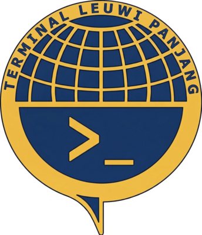
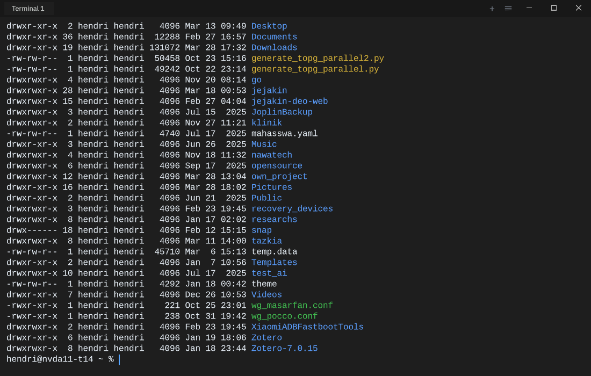

<p align="center">
  
</p>

# Leuwi Panjang Terminal

A lightweight, modern, GPU-accelerated terminal emulator built in Rust. Combines the best ideas from iTerm2, Kitty, and GNOME Terminal while being cross-platform including mobile.



## Download

**[Latest Release](https://github.com/situkangsayur/leuwi-panjang/releases/latest)**

| Platform | Binary |
|----------|--------|
| Linux x86_64 | `leuwi-panjang-linux-x86_64` |
| macOS ARM64 | `leuwi-panjang-macos-arm64` |
| Windows x86_64 | `leuwi-panjang-windows-x86_64.exe` |

```bash
# Linux
chmod +x leuwi-panjang-linux-x86_64
./leuwi-panjang-linux-x86_64
```

## Why Leuwi Panjang?

Existing terminals make trade-offs:
- **GNOME Terminal**: Stable but no splits, no plugins, no GPU rendering, header bar wastes space
- **Kitty**: Fast GPU rendering but SSH is broken (`kitty +kitten ssh` required), no Windows support
- **iTerm2**: Best features but macOS only, memory hungry, slow startup
- **Alacritty**: Fast and minimal but no tabs, no splits, no extensions

Leuwi Panjang takes the best from each and adds features none of them have.

## Features

### Core Terminal
- **GPU-accelerated rendering** via wgpu (Vulkan/Metal/DX12/OpenGL)
- **Chromeless window** - no titlebar, tabs ARE the header (Chrome-style)
- **Rounded corners** - modern look, configurable radius
- **Split panes** - horizontal & vertical, arbitrarily nested
- **Tab/Pane search** - fuzzy search and jump to any tab or pane (like Zen Browser)
- **Command suggestions** - built-in autocomplete with history, flags, paths
- **Shell integration** - prompt marks, CWD tracking, command status
- **Standard SSH** - uses `xterm-256color`, SSH just works
- **Ligature support** - via rustybuzz (Rust HarfBuzz)
- **Image protocols** - Kitty Graphics + Sixel + iTerm2 inline images

### Configurability
- **TOML config** - human-readable, version-controllable
- **GUI settings** - full graphical settings panel
- **Theme system** - theme browser with live preview
- **Profile system** - auto-switch profiles by hostname/path
- **Configurable shortcuts** - remap any key combination
- **Status bar** - modular components (git, CPU, memory, clock, etc.)

### Plugin System (WASM)
- **Sandboxed plugins** - safe, language-agnostic WASM runtime
- **AI Integration** - Claude CLI, Gemini CLI, Ollama (separate plugins)
- **Credential vault** - AES-256 encrypted storage for passwords/keys
- **Audit trail** - who did what, AI or human, with timestamps
- **Permission system** - AI always asks before executing commands

### Cross-Platform
- Linux (X11 + Wayland)
- macOS
- Windows
- Android (Flutter + Rust)
- iOS (Flutter + Rust)

### Mobile Features
- SSH connection manager (save, organize, one-tap connect)
- SSH key management
- Extra key row (Tab, Ctrl, Alt, Esc, Arrows)
- Remote AI integration via WireGuard tunnel

## Screenshots

*Coming soon*

## Installation

### From Source
```bash
git clone git@github.com:situkangsayur/leuwi-panjang.git
cd leuwi-panjang
cargo build --release
cargo install --path .
```

### Package Managers (planned)
```bash
# Arch Linux
yay -S leuwi-panjang

# macOS
brew install leuwi-panjang

# Ubuntu/Debian
sudo apt install leuwi-panjang
```

## Quick Start

```bash
# Launch
leuwi-panjang

# With a session layout
leuwi-panjang --session dev
```

### Essential Shortcuts

| Action | Shortcut |
|--------|----------|
| New tab | `Ctrl+Shift+T` |
| Split horizontal | `Ctrl+Shift+H` |
| Split vertical | `Ctrl+Shift+V` |
| Navigate panes | `Alt+Arrow` |
| Search tabs/panes | `Ctrl+Shift+Space` |
| Settings | `Ctrl+Shift+,` |
| Command palette | `Ctrl+Shift+P` |

## Configuration

Edit `~/.config/leuwi-panjang/config.toml`:

```toml
[appearance]
theme = "leuwi-dark"
font_family = "JetBrains Mono"
font_size = 13.0
background_opacity = 0.95
corner_radius = 12
window_decorations = "none"

[suggestions]
enabled = true
history_based = true
man_page_flags = true
```

See [Configuration Reference](docs/guides/03-configuration.md) for all options.

## Plugins

```bash
# Install AI plugin
leuwi plugin install ai-claude

# List plugins
leuwi plugin list
```

Available plugins:
- `ai-claude` - Claude CLI integration
- `ai-gemini` - Gemini CLI integration
- `ai-ollama` - Local AI via Ollama
- `ai-wireguard` - Remote AI via WireGuard

## Companion: nvim-leuwi-panjang

A lightweight Neovim IDE config that pairs with Leuwi Panjang Terminal. Replaces CoC with native LSP for 5x faster startup and 3x less memory.

```bash
git clone git@github.com:situkangsayur/nvim-leuwi-panjang.git ~/.config/nvim
```

Supports: Java, Go, Rust, Python, JavaScript, TypeScript, Kotlin, Shell, HTML, CSS, PHP, and more.

See [nvim-leuwi-panjang repo](https://github.com/situkangsayur/nvim-leuwi-panjang) for details.

## Documentation

| Document | Description |
|----------|-------------|
| [Master Plan](docs/architecture/01-master-plan.md) | Full architecture and roadmap |
| [Core Features](docs/features/01-core-features.md) | Terminal features in detail |
| [Plugin System](docs/features/02-plugin-system.md) | WASM plugin architecture |
| [AI Integration](docs/features/03-ai-integration.md) | AI plugin details |
| [Mobile App](docs/mobile/01-mobile-app.md) | Mobile architecture and features |
| [Getting Started](docs/guides/01-getting-started.md) | Installation and first steps |
| [Keymaps](docs/guides/02-keymaps.md) | All keyboard shortcuts |
| [Configuration](docs/guides/03-configuration.md) | Full config reference |
| [Terminal Comparison](docs/research/06-terminal-comparison.md) | How we compare to others |

### Research
| Document | Description |
|----------|-------------|
| [GNOME Terminal Analysis](docs/research/01-gnome-terminal-analysis.md) | GNOME Terminal deep-dive |
| [Kitty Analysis](docs/research/02-kitty-analysis.md) | Kitty Terminal deep-dive |
| [iTerm2 Analysis](docs/research/03-iterm2-analysis.md) | iTerm2 deep-dive |
| [Rust Ecosystem](docs/research/04-rust-terminal-ecosystem.md) | Rust libraries and existing terminals |
| [Nvim IDE Research](docs/research/05-nvim-lightweight-ide.md) | Native LSP vs CoC research |

## Project Structure

```
leuwi-panjang/
├── src/main.rs             # Makepad app entry point
├── crates/
│   ├── leuwi-terminal/     # VT parser, screen buffer
│   ├── leuwi-renderer/     # Terminal grid (Makepad shaders)
│   ├── leuwi-ui/           # Makepad UI: tabs, splits, status bar
│   ├── leuwi-pty/          # PTY management (desktop)
│   ├── leuwi-ssh/          # SSH client (mobile primary)
│   ├── leuwi-config/       # TOML config, profiles, themes
│   ├── leuwi-suggestions/  # Command suggestion engine
│   ├── leuwi-plugin-host/  # WASM plugin runtime
│   ├── leuwi-plugin-sdk/   # Plugin SDK (compiles to WASM)
│   ├── leuwi-crypto/       # Credential vault, encryption
│   ├── leuwi-search/       # Scrollback search, tab/pane search
│   ├── leuwi-shell-integration/  # Shell integration
│   └── leuwi-wireguard/    # Embedded WireGuard (boringtun)
├── docs/                   # Documentation
├── themes/                 # Built-in themes
└── completions/            # Command completion specs
```

Single codebase — desktop and mobile build from same source.

## Repositories

| Repository | Description |
|------------|-------------|
| [leuwi-panjang](https://github.com/situkangsayur/leuwi-panjang) | Terminal emulator (this repo) |
| [nvim-leuwi-panjang](https://github.com/situkangsayur/nvim-leuwi-panjang) | Neovim IDE config |
| [leuwi-panjang-plugins](https://github.com/situkangsayur/leuwi-panjang-plugins) | Plugin repository |

## Tech Stack

- **Language**: 100% Rust
- **UI Framework**: Makepad (single codebase for desktop + mobile)
- **GPU Rendering**: Makepad renderer (Vulkan/Metal/OpenGL/WebGL)
- **Text Shaping**: rustybuzz (HarfBuzz in Rust)
- **Config**: TOML (serde)
- **Plugin System**: WASM (wasmtime)
- **Embedded WireGuard**: boringtun (zero-config pairing)
- **SSH Client**: russh (pure Rust)
- **Desktop + Mobile**: same code, same binary per platform

## Roadmap

- [x] Project plan and documentation
- [ ] Phase 1: Core terminal (VT parser, GPU rendering, tabs)
- [ ] Phase 2: Advanced features (splits, suggestions, shell integration)
- [ ] Phase 3: Plugin system (WASM, AI plugins, credential vault)
- [ ] Phase 4: nvim-leuwi-panjang config
- [ ] Phase 5: Mobile app (Flutter + Rust)
- [ ] Phase 6: WireGuard backend server
- [ ] Phase 7: Polish and release

## Contributing

Contributions welcome! Please read the documentation in `docs/` first.

## License

MIT

---

*Built with Rust for efficiency, performance, and lower carbon emissions.*
